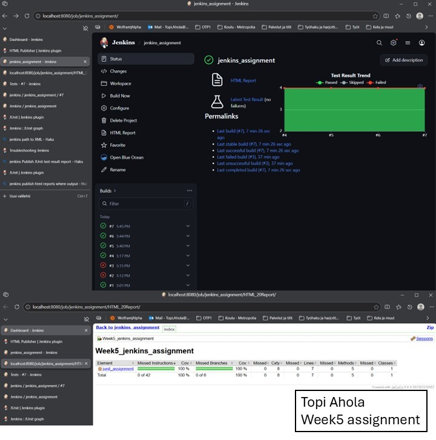

### Week5_assignment
Continues previous assignment

1. Extend the Project with Kelvin-to-Celsius Functionality

2. Extend the JUnit Tests Create new JUnit test cases to verify the correctness of your newly added Kelvin-to-Celsius conversion function.

3. Generate a Code Coverage Report Create a JaCoCo code coverage report for the entire project to ensure your tests cover all the code.

4. Set Up Jenkins and a JaCoCo Report (Optional)

5. Create a public GitHub Repo and commit the final version to the newelly created Repository

6. Create a local Jenkins project

#### Submission

1. Screenshot: Take a screenshot of the successful test report in Jenkins. Ensure your name is visible in the screenshot (e.g., in the Jenkins job name, browser tab, or via a watermark).

2. Upload: Submit the following two items to the designated Oma folder:
The screenshot of the Jenkins test report.
The link to your GitHub repository.

<figure>

<figcaption>Screenshot of Jenkins test reports</figcaption>
</figure>

   