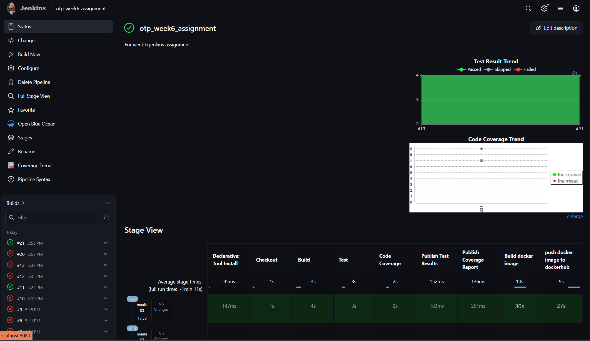
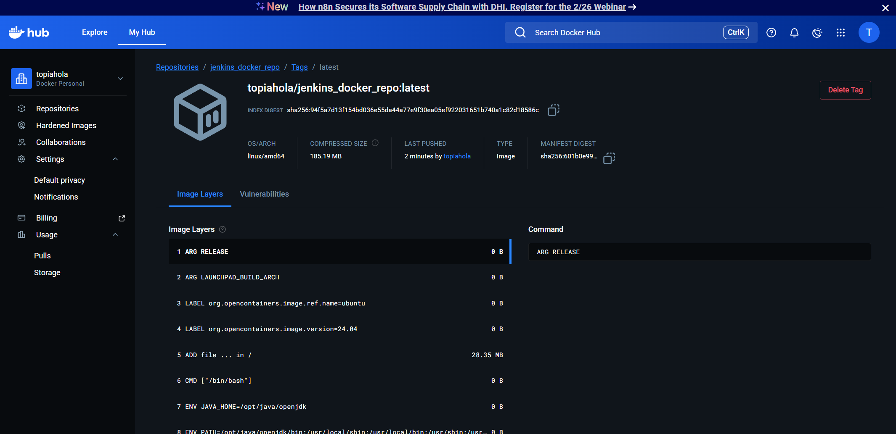
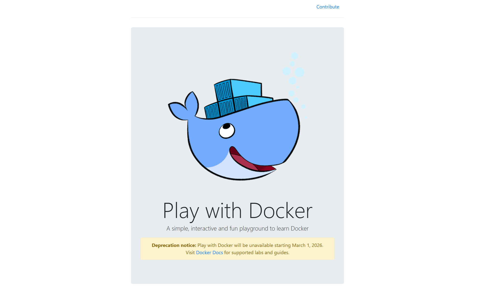
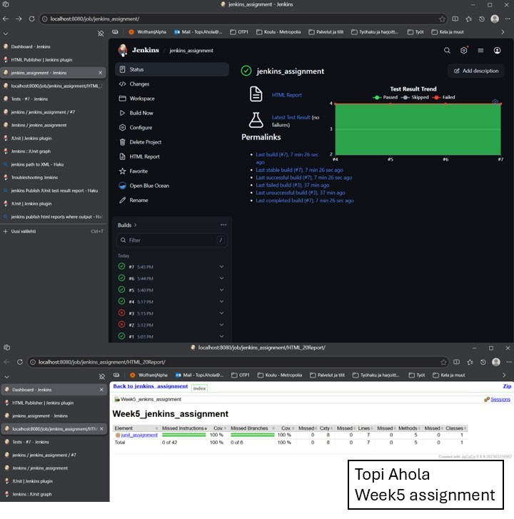

### Week 6 assignment

Based on your Week 5 in-class assignment (Temperature Converter), implement the following steps and submit the results in Oma:

Create a Jenkinsfile (pipeline) to generate a JaCoCo report.

Build and run the local Docker image of your application and verify that everything is working correctly.

Extend the pipeline to deploy the image to hub.docker.com (Optional).

#### Submission
Share the link and screenshots in Oma

1. GitHub repository link  
2. Screenshot of a successfully executed pipeline (e.g., Ocean Blue view or stage view). See the sample outout from class demo (TravelCal.java)
3. Screenshots showing the successful execution of the labs.play.docker Docker image, See the sample outout from class demo (TravelCal.java)

<figure>

<figcaption>Screenshot of Jenkins pipeline</figcaption>
</figure>

<figure>

<figcaption>Screenshot of built image running in docker container</figcaption>
</figure>

<figure>

<figcaption>Screenshot of Play with Docker being shut down</figcaption>
</figure>

 
 

### Week5 assignment
Continues previous assignment

1. Extend the Project with Kelvin-to-Celsius Functionality

2. Extend the JUnit Tests Create new JUnit test cases to verify the correctness of your newly added Kelvin-to-Celsius conversion function.

3. Generate a Code Coverage Report Create a JaCoCo code coverage report for the entire project to ensure your tests cover all the code.

4. Set Up Jenkins and a JaCoCo Report (Optional)

5. Create a public GitHub Repo and commit the final version to the newelly created Repository

6. Create a local Jenkins project

#### Submission

1. Screenshot: Take a screenshot of the successful test report in Jenkins. Ensure your name is visible in the screenshot (e.g., in the Jenkins job name, browser tab, or via a watermark).

2. Upload: Submit the following two items to the designated Oma folder:
The screenshot of the Jenkins test report.
The link to your GitHub repository.

<figure>

<figcaption>Screenshot of Jenkins test reports</figcaption>
</figure>

   